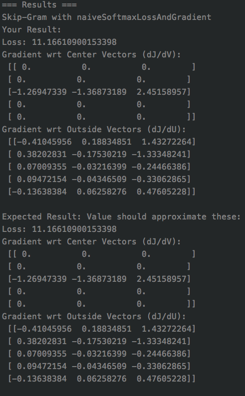
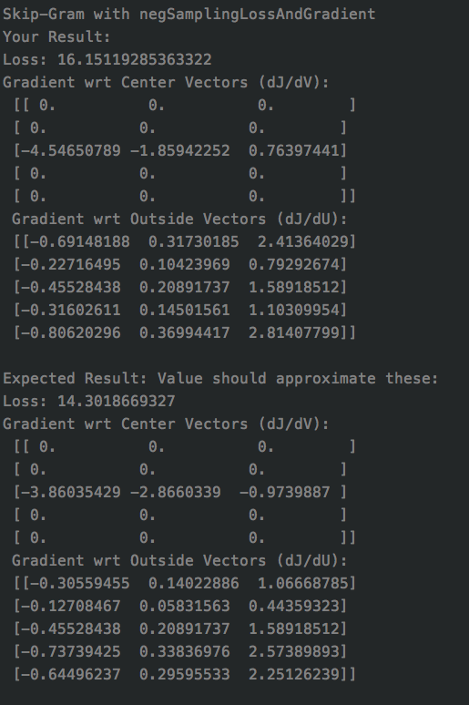

# CS224n_exercise
- Stanford 2019 CS224n:Natural Language Processing with Deep Learning: [course link](http://web.stanford.edu/class/cs224n/index.html)

## Schedule
| Due Date | Assignment                         | Done |
| :------- | ---------------------------------- | ---- |
| 1/15     | Assignment1: exploring word vector | V    |
| 1/22     | Assignment2                        | V    |
| 1/29     | Assignment3                        |      |
| 2/7      | Assignment4                        |      |
| 2/21     | Assignment5                        |      |

## Issue 

(open) 1/20: In `word2vec.py`  Skip-Gram with negSamplingLossAndGradient function 

* My result of loss, gradCenterVec, gradOutsideVecs not close to the expected value as TA given, can anyone give me some advice? Is there any tiny problem that I ignored? Thanks. 

* What I have checked: the first result is correct, so I think the problem may not be in the `skipgram` function. The two result printed as following.

* Furthermore, I search the concept of **negative sampling in NLP** and I think the problem as following: the way to calculate loss using the positive samples (bcz they used the 1 - negative probability) , make sense or not? 
